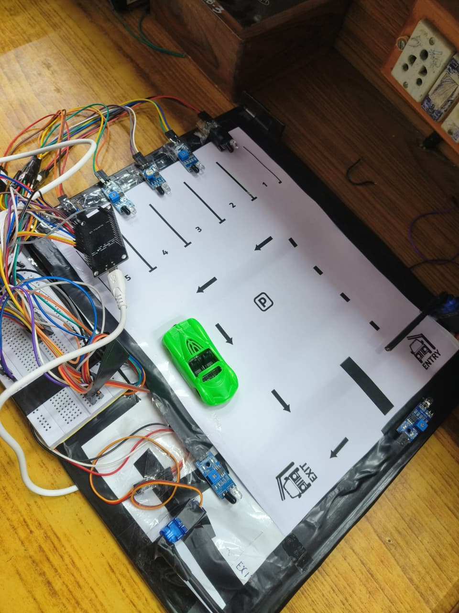

# Smart Parking IoT System – SmartLot360




## 🎥 Demo Video

Click to watch the full demonstration:

[](Demo%20Final.mp4)

> (GitHub allows MP4 playback when clicking the link.)


## 📌 Overview
SmartLot360 is a complete **IoT-based smart parking management system** that combines hardware automation with a real-time online dashboard.  
It uses **IR sensors**, **servo motors**, **microcontrollers**, and a **Firebase Realtime Database** backend to monitor and control a miniature parking layout.

The system detects vehicles, manages gates automatically, logs activity, and updates the web dashboard live—making it a practical demonstration of **IoT + Web + Automation**.

---

## 🚗 Key Features

### 🔹 Hardware (IoT)
- **IR Sensors** for detecting vehicle presence in 5 parking slots  
- **IR sensors at Entry & Exit gates** for scanning incoming/outgoing vehicles  
- **Servo motors** to automatically open/close barriers  
- **Microcontroller setup** with a breadboard & wiring  
- Real-time status push using **Firebase**  

### 🔹 Software (Dashboard)
- Live dashboard built with **JavaScript, HTML, CSS**  
- Real-time fetch cycle every 2 seconds  
- Visual indicators for:
  - Slot occupancy  
  - Gate open/close state  
  - System mode (AUTO / MANUAL)  
  - Activity logs  
- Remote commands from dashboard → hardware (via Firebase paths)

---

## 🛠️ Tech Stack

### **Hardware**
- IR Proximity Sensors  
- Servo Motors  
- Microcontroller (Arduino or similar)  
- Breadboard + Wires  

### **Software**
- JavaScript (Async/Await, Fetch API)  
- Firebase Realtime Database  
- HTML/CSS  
- REST API  
- DOM Manipulation  

---

## 🖥️ Dashboard Code Overview

The dashboard communicates with Firebase:

### **Fetching live state**
```javascript
async function getLiveState() {
  try {
    const response = await fetch(API_URL);
    if (!response.ok) {
      throw new Error(`HTTP error! status: ${response.status}`);
    }
    return await response.json();
  } catch (error) {
    console.error("Could not fetch live state:", error);
    return null;
  }
}
